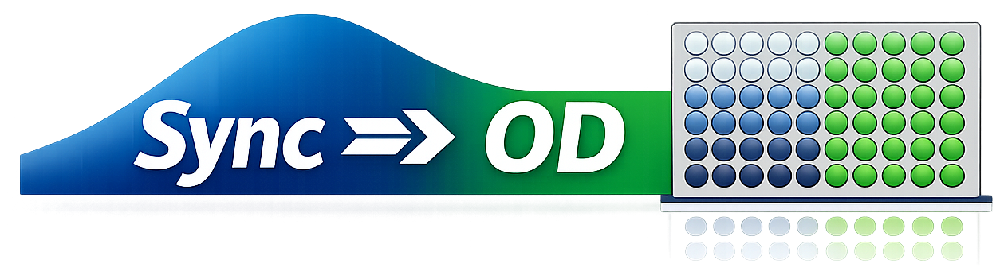

<p align="left">
  
</p>

# Synchronising OD600 of cell cultures using Biomek i7

A Python script that generates a Biomek i7-compatible CSV file to dilute each cell culture to a target OD600, giving synchronised growth across a 96-well plate.

---

## Requirements

- Python environment managed with [uv](https://github.com/astral-sh/uv)
- Two Excel input files (see [Input files](#input-files))
- A 96-well plate reader (e.g., BioTek Gen5)

---

## Installation and setting up

```bash
git clone https://github.com/famotsuka/sync-OD.git
cd sync-OD
uv sync
source .venv/bin/activate
```

---

## Input files

The script expects two Excel files in the project root.
Two examples are given:

### 1. Culture ID file (`id_example.xlsx`)
Maps each well to a culture ID. Must contain exactly these two columns:

| Destination Well | post_id   |
|------------------|-----------|
| A01              | cells1    |
| A02              | mutant1   |
| ...              | ...       |

- `Destination Well`: well address in the format `A01`–`H12` (letter + zero-padded number)
- `post_id`: unique identifier for each culture

### 2. OD600 readings file (`example_OD.xlsx`)
Raw OD600 values exported from the plate reader. Expected format:
- Row index: plate rows (A–H)
- Column headers: plate columns as integers (1–12)

> This is the standard export format from BioTek Gen5. No manual reformatting should be needed.

---

## Suggested protocol

1. Prepare the culture ID Excel file mapping each well to its strain or mutant ID.

2. Dilute the overnight culture **1:3** in sterile water in a 96-deep-well plate:
   - 100 µL culture + 300 µL H₂O → **400 µL total**

3. Prepare the OD600 measurement plate:
   - Transfer **50 µL** of the diluted culture into **50 µL H₂O** in a 96-well microtiter plate

4. Measure OD600 using a plate reader (e.g., BioTek Gen5) and export the readings as an Excel file.

5. Run the script:
   ```bash
   python dilution_volumes.py
   ```
   The script will calculate how much sterile water to add to each well to reach the target OD600.

6. Use `biomek_inputs/sync_OD_biomek.csv` into the Biomek i7 software with "transfer with csv" to execute the dilutions.

7. Inoculate the growth plate by adding **100 µL** of the diluted culture to **400 µL** of growth media (e.g., LB + antibiotics) in a 96-deep-well plate, shaking at 37° and wait 2h 30 min.

---

## Key parameters

These constants are defined at the top of `dilution_volumes.py` and can be adjusted to match your protocol:

| Parameter           | Default | Description                                                  |
|---------------------|---------|--------------------------------------------------------------|
| `TARGET_OD`         | `0.55`  | Target OD600 for synchronised growth                         |
| `REMAINING_VOL`     | `350`   | µL remaining in well after OD sampling (400 − 50)           |
| `CALIBRATION_LIMIT` | `0.180` | Upper OD limit of the linear calibration curve              |
| `MAX_VOLUME`        | `1300`  | Biomek hard pipetting limit (µL); wells above this are dropped |

---

## Calibration and OD correction

The script converts plate reader OD values to true OD600 using a linear calibration curve derived from side-by-side cuvette and plate reader measurements:

```
true OD = 8.2258 × (measured OD) − 0.3098
```

This curve is valid up to a **measured OD of 0.170**. Above this limit, the relationship becomes non-linear and the script applies a stepwise correction:

- For every **0.025 OD units** above 0.170, the calculated water volume is increased by **20%**
- Wells that would require **more than 1300 µL** of water are considered undilutable and are **silently dropped** from the output

When out-of-range wells are detected, the script will pause and display a warning in the terminal, showing which wells were corrected and which were dropped. You will be asked to:

```
[1] Proceed with corrected volumes
[2] Cancel — re-dilute high-OD wells and re-measure
[3] Cancel — add a new calibration line for high OD values
```

If accuracy is critical for high-OD wells, option 2 (re-diluting) or option 3 (new calibration) is recommended.

---

## Output files

All outputs are saved to the `biomek_inputs/` folder:

| File                      | Description                                                                 |
|---------------------------|-----------------------------------------------------------------------------|
| `sync_OD_biomek.csv`      | **Biomek i7 input file.** Contains Source Plate, Source Well, Destination Plate, Destination Well, and Volume columns. Add this as the transfer csv file. |
| `sync_OD_ID.csv`          | Same as above but includes the culture Name and OD value columns. Useful for record-keeping and QC. |
| `TEMP_OD_dilution.csv`    | Intermediate file with raw OD and calculated volumes before filtering. Useful for debugging. |

---

## Well filtering rules

| Condition                        | Action                              |
|----------------------------------|-------------------------------------|
| OD < 0.085                       | Excluded (too low to dilute reliably) |
| 0.085 ≤ OD < 0.110               | Volume set to 0 (no dilution needed) |
| 0.110 ≤ OD ≤ 0.180               | Normal calibration applied          |
| OD > 0.180                       | Stepwise correction applied (+20% per 0.050 step) |
| Corrected volume > 1200 µL       | Well dropped from output silently   |
